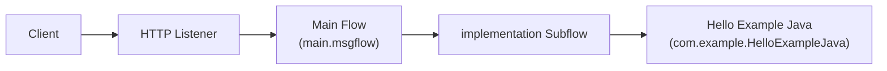

# HelloExample Documentation

This directory contains technical documentation for the IBM App Connect
Enterprise (ACE) **HelloExample** application message flows.

## Overview

HelloExample is a small ACE application that exposes an HTTP endpoint and
returns a JSON greeting. A client sends an HTTP request to `/hello` with an
optional `name` query-string parameter. The application processes the request
through a JavaCompute node and replies with a JSON message:

- For the known user `TestUser`, it responds with `{"Message": "Hello TestUser!"}`.
- For any other value, it responds with `{"Message": "Invalid user: <name>!"}`.

## Message flows

| Flow                        | File                       | Description                                                        |
| --------------------------- | -------------------------- | ------------------------------------------------------------------ |
| [Main Message Flow](main-flow.md) | `../main.msgflow`          | HTTP entry point that receives requests and returns responses.     |
| [Implementation Subflow](implementation-subflow.md) | `../implementation.subflow` | Runs the `Hello Example Java` JavaCompute logic that builds the response. |

## Architecture

The main flow handles the HTTP transport, while the subflow encapsulates the
business logic in the `com.example.HelloExampleJava` JavaCompute node.
