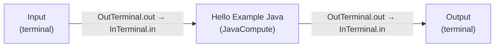
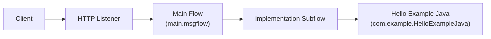

# Implementation Subflow (`implementation.subflow`)

The `implementation` subflow contains the processing logic invoked by the
[main message flow](main-flow.md). It routes the incoming message through a
JavaCompute node that builds a JSON greeting response.

## Purpose

The subflow isolates the application's business logic from the HTTP transport
handled by `main.msgflow`. It receives a message at its input terminal, passes
it to the `Hello Example Java` JavaCompute node (implemented by
`com.example.HelloExampleJava`), and returns the resulting message at its
output terminal.

## Request/response path

1. The subflow **Input** terminal receives the message propagated from the
   main flow's HTTP Input node.
2. The message is passed to the **Hello Example Java** JavaCompute node, which
   reads the `name` query parameter and constructs the JSON response.
3. The processed message is propagated to the subflow **Output** terminal,
   which returns control to the main flow (and ultimately the HTTP Reply node).

## Nodes

| Name               | Type                              | Role                                                                    |
| ------------------ | --------------------------------- | ----------------------------------------------------------------------- |
| Input              | Input terminal (`FCMSource`)      | Entry point of the subflow; receives the message from the main flow.    |
| Hello Example Java | JavaCompute (`ComIbmJavaCompute`) | Runs `com.example.HelloExampleJava` to build the JSON greeting message. |
| Output             | Output terminal (`FCMSink`)       | Exit point of the subflow; returns the processed message to the caller. |

## Flow diagram

## Java logic

The `Hello Example Java` node is implemented by
`com.example.HelloExampleJava`. Its `evaluate()` method:

- Reads the `name` query-string parameter from the local environment
  (`HTTP/Input/QueryString/name`).
- If `name` equals `TestUser`, it returns the JSON message
  `{"Message": "Hello TestUser!"}`.
- Otherwise, it returns the JSON message
  `{"Message": "Invalid user: <name>!"}`.

The response is written as a single-value JSON message and propagated to the
`out` terminal.

## Architecture

## Related documents

- [Main Message Flow](main-flow.md)
- [Documentation Overview](README.md)
