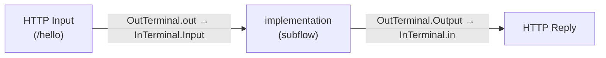
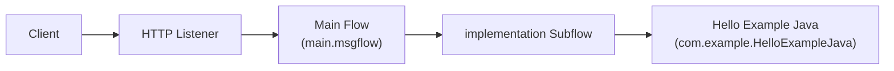

# Main Message Flow (`main.msgflow`)

The main message flow exposes the HelloExample application over HTTP. It
receives an inbound HTTP request, delegates the processing to the
`implementation` subflow, and returns the generated response to the caller.

## Purpose

`main.msgflow` is the entry point of the HelloExample application. It listens
for HTTP requests on the URL path `/hello`, hands the message off to the
`implementation` subflow (which runs the Java logic), and replies to the
original client with the result.

## Request/response path

1. A client sends an HTTP request to `/hello` (optionally with a `name`
   query-string parameter).
2. The **HTTP Input** node receives the request. Query-string parsing is
   enabled, so the parameters (for example `name`) are made available to the
   flow in the local environment.
3. The message is propagated to the **implementation** subflow node, which
   contains the `Hello Example Java` JavaCompute processing.
4. The subflow returns the message to the **HTTP Reply** node, which sends the
   response back to the original client.

## Nodes

| Name           | Type                        | Role                                                                                  |
| -------------- | --------------------------- | ------------------------------------------------------------------------------------- |
| HTTP Input     | HTTP Input (`ComIbmWSInput`) | Receives inbound HTTP requests on URL `/hello`; query-string parsing is enabled.      |
| implementation | Subflow (`implementation.subflow`) | Runs the `Hello Example Java` JavaCompute logic that builds the JSON response.  |
| HTTP Reply     | HTTP Reply (`ComIbmWSReply`) | Sends the generated response back to the calling HTTP client.                         |

## Flow diagram

## Architecture

## Related documents

- [Implementation Subflow](implementation-subflow.md)
- [Documentation Overview](README.md)
